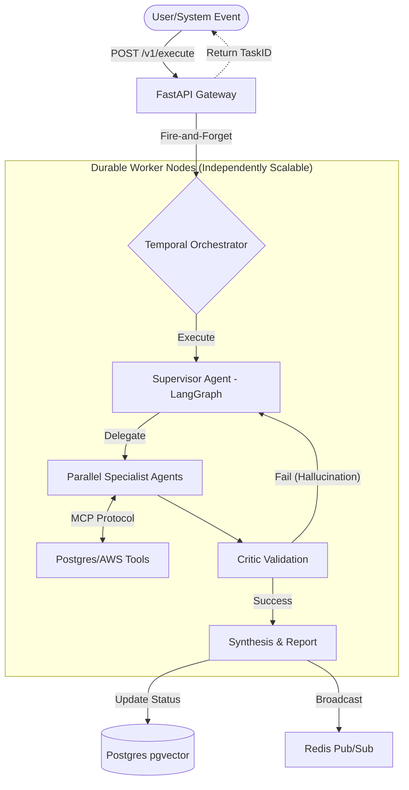

# 🌌 NexusCore: Distributed Multi-Agent System


NexusCore is a production-grade, distributed Multi-Agent System (MAS). Moving beyond simple, fragile LLM wrappers, NexusCore treats AI agents as **durable microservices**. It leverages an asynchronous, event-driven architecture designed to guarantee task completion, independent scaling, and fault tolerance.

## 🚀 Why NexusCore?

Traditional API-driven LLM applications suffer from HTTP timeouts, context loss on pod crashes, and synchronous bottlenecks. NexusCore solves this by decoupling the API ingress from the AI reasoning engine:

* **Fire-and-Forget Ingress:** A stateless FastAPI gateway accepts requests, validates data contracts, and instantly returns a `202 Accepted` with a UUID.
* **Durable Execution:** Temporal orchestrates the workflow. If an AI worker pod crashes mid-thought, Temporal seamlessly resumes the exact state on a new node.
* **Graph-Based Reasoning:** LangGraph powers the "Brain," dynamically routing tasks between specialized agents (Supervisor, DB Agent, Infra Agent) and a Critic for hallucination checks.
* **Lightning Fast Tooling:** Built completely on `uv` for ultra-fast dependency management and environment resolution.

## 🏗️ Architecture



## 🛠️ Tech Stack

* **Package Manager:** `uv` (Replaces Poetry/Pip for maximum speed)
* **API Gateway:** FastAPI + Pydantic (Strict data validation)
* **Orchestration Engine:** Temporal.io
* **AI State Machine:** LangGraph + LangChain Core
* **Infrastructure:** PostgreSQL (with pgvector) + Redis Stack
* **Deployment:** Docker Compose (Local) / Kubernetes Ready (Production)

## 📁 Repository Structure

```text
nexuscore/
├── deploy/
│   └── docker/              # Dockerfiles and K8s manifests
├── src/
│   ├── api/                 # FastAPI Gateway & lifespans
│   ├── agents/              # LangGraph nodes and routing logic
│   ├── workflows/           # Temporal durable execution logic
│   ├── core/                # Temporal Worker daemon
│   ├── models/              # Pydantic schemas and typed dicts
│   ├── mcp/                 # Model Context Protocol servers
│   └── db/                  # Async DB connections
├── tests/                   # Pytest suite
├── docker-compose.yml       # Local infrastructure setup
├── pyproject.toml           # uv project definitions
└── README.md
```

## 🏎️ Local Quickstart

Get the system running locally in under 3 minutes.

### 1. Prerequisites
* [Docker Desktop](https://www.docker.com/products/docker-desktop/) or equivalent.
* [Temporal CLI](https://learn.temporal.io/getting_started/python/dev_environment/) (`brew install temporal`).
* [uv](https://github.com/astral-sh/uv) (`curl -LsSf https://astral.sh/uv/install.sh | sh`).

### 2. Boot Infrastructure
Spin up PostgreSQL (with pgvector) and Redis Stack:
```bash
docker compose up -d
```

### 3. Start the Orchestrator
In a new terminal, start the local Temporal development server:
```bash
temporal server start-dev
```

### 4. Launch the AI Worker
In a new terminal, start the worker daemon that listens for workflow tasks:
```bash
uv run python -m src.core.worker
```

### 5. Start the API Gateway
In your final terminal, boot the FastAPI server:
```bash
uv run uvicorn src.api.main:app --reload --port 8000
```

### 6. Trigger a Task
Send a test request to watch the distributed graph in action:
```bash
curl -X POST "http://localhost:8000/v1/execute" \
     -H "Content-Type: application/json" \
     -d '{
           "prompt": "Check the database for any anomalies.",
           "user_id": "admin-123"
         }'
```

## 🗺️ Roadmap

- [x] **Phase 1:** Infrastructure Core (Docker, Gateway, Temporal, Baseline Graph)
- [ ] **Phase 2:** Real LLM Integration & Pydantic Output Enforcement
- [ ] **Phase 3:** MCP Sidecar Setup (Postgres & AWS Tooling)
- [ ] **Phase 4:** Redis Pub/Sub & WebSocket real-time UI integration
```