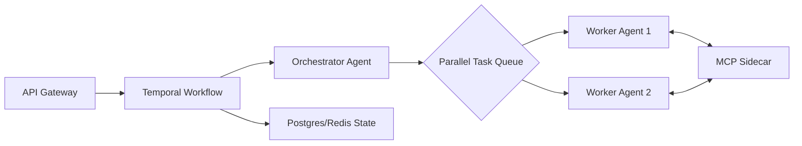

This is the **`DEVDOC.md`** for NexusCore. It is designed to be the foundational technical manual for your engineering team, ensuring that every line of code written contributes to a robust, distributed, and production-hardened AI system.

---

# 🛠 NexusCore Development Documentation (DEVDOC.md)
**Version:** 1.0.0-PROD  
**Status:** Design Confirmed / Implementation Phase  
**Target:** Senior AI Backend Engineers  

---

## 1. System Overview
NexusCore is a **Distributed Multi-Agent System (MAS)** designed for high-reliability enterprise automation. Unlike simple LLM wrappers, NexusCore treats AI agents as **durable microservices** that communicate via the **Model Context Protocol (MCP)** and are orchestrated by a state-managed workflow engine (**Temporal**).

### High-Level Architectural Flow


---

## 2. Core Service Definitions

### 2.1 API Ingress (FastAPI)
The entry point for all external requests. It is **stateless** and designed for high throughput.
* **Responsibility:** Authentication (OIDC), Input Validation (Pydantic), and Workflow Initiation.
* **Design Pattern:** Fire-and-Forget. The API returns a `task_id` immediately; results are pushed via WebSockets or retrieved via Polling.

### 2.2 Workflow Orchestration (Temporal)
This is the "Safety Net" of the system.
* **Workflows:** Define the high-level business logic (e.g., "Remediate Server Issue").
* **Activities:** Discrete, idempotent steps (e.g., "Query Database," "Send Slack Message").
* **Durability:** Temporal records every activity. If a worker pod crashes, the workflow migrates to a healthy pod and resumes from the last successful step.

### 2.3 Agent Logic (LangGraph)
Each "Brain" in the system is a LangGraph state machine.
* **Supervisor Node:** Acts as the router/planner.
* **Specialist Nodes:** Narrowly scoped agents with specific system prompts.
* **Conditional Edges:** Logic-based routing (e.g., "If logs are empty, try searching the Database").

---

## 3. Data Schema & Persistence

### 3.1 PostgreSQL (Relational + Vector)
We utilize **PostgreSQL 16** with **pgvector** for three purposes:
1.  **System State:** Audit logs, execution history, and user permissions.
2.  **Long-Term Memory:** Historical agent thoughts and outcomes (for "Few-Shot" prompting).
3.  **RAG Storage:** Document embeddings for internal knowledge retrieval.

### 3.2 Redis Stack
* **Task Queueing:** High-speed signaling between agents.
* **Context Cache:** Storing current conversation windows to avoid repeated DB hits.
* **Pub/Sub:** Streaming agent "thoughts" to the frontend in real-time.

---

## 4. The MCP (Model Context Protocol) Layer
**Strict Rule:** No agent may import a proprietary SDK (e.g., `boto3`, `google-cloud-sdk`) directly. All tool usage must go through an MCP Server.

* **Why?** This decouples the AI logic from the tool implementation. We can update the AWS MCP server without touching the Agent code.
* **Transport:** Agents communicate with MCP servers via **JSON-RPC**.
* **Security:** MCP servers run in isolated environments (Sidecars) with least-privilege access.

---

## 5. Senior Engineering Standards

### 5.1 Idempotency & Task Keys
Every request must include an `idempotency_key` (UUID v4).
```python
# Activity Execution Example
await workflow.execute_activity(
    perform_payment,
    args=[payment_data],
    idempotency_key=request.uuid
)
```

### 5.2 Structured Outputs (The Pydantic Gate)
LLM outputs must be parsed through a Pydantic model. If validation fails, the system must trigger a **Self-Correction loop** (max 3 retries).
```python
class AgentResponse(BaseModel):
    analysis: str
    tool_to_call: Optional[str]
    confidence_score: float = Field(ge=0.7) # Fail if LLM is "unsure"
```

### 5.3 Observability (The "Trace Everything" Rule)
We use **OpenTelemetry** for system-level traces and **LangSmith** for LLM-level traces.
* **Root Trace ID:** Generated at the Gateway and passed through Temporal $\rightarrow$ LangGraph $\rightarrow$ MCP.
* **Metrics:** We track `token_usage_per_request`, `latency_per_node`, and `mcp_error_rate`.

---

## 6. Implementation Roadmap

| Phase | Milestone | Deliverable |
| :--- | :--- | :--- |
| **Phase 1** | **Infrastructure Core** | Docker Compose with Temporal, Postgres, and Redis. |
| **Phase 2** | **MCP Integration** | Production-ready AWS and GitHub MCP servers. |
| **Phase 3** | **Orchestration** | LangGraph Supervisor with parallel task execution logic. |
| **Phase 4** | **Hardening** | Implementation of HITL (Human-in-the-loop) and Critic agents. |

---

## 7. Local Development Quickstart
1.  **Clone the Repo**
2.  **Run Environment:** `docker-compose up -d` (Spins up Temporal, DBs, and MCP sidecars).
3.  **Install Dependencies:** `poetry install` (Strict dependency management).
4.  **Launch Workers:** `python -m src.workers.agent_worker`
5.  **Trigger Test Task:** `python -m src.scripts.trigger_remediation`

---

**Would you like me to generate the `src/models/state.py` file to define exactly how the agent state is stored in the database?**