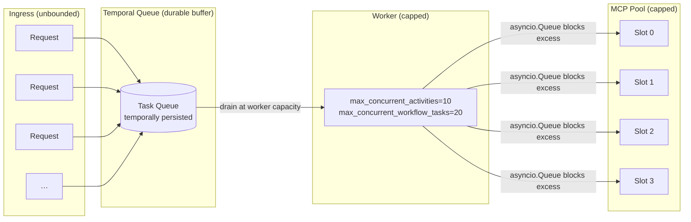
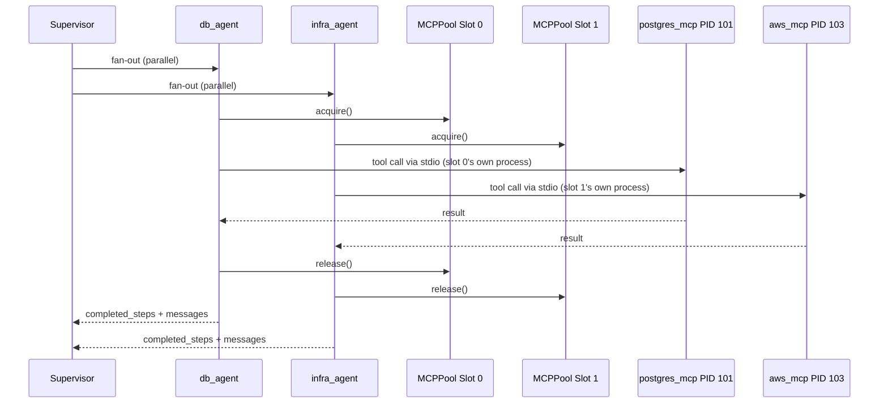

# NexusCore: System Flow & QPS Design

---

## 1. Request Lifecycle

```mermaid
graph TD
    User([Client]) -->|POST /v1/execute| GW[FastAPI Gateway]
    GW -->|202 Accepted + task_id| User
    GW -->|BackgroundTask: start_workflow| TW{Temporal\nOrchestrator}

    subgraph "Durable Execution (Temporal)"
        TW -->|Activity: execute_agent_graph\n5 min timeout · max 3 retries| LG[LangGraph\nState Machine]

        LG --> SV[Supervisor Node\ngpt-4o-mini + structured output]
        SV -->|confidence < threshold| RETRY([Temporal Retry\nwith backoff])
        RETRY --> SV

        SV -->|fan-out parallel| PA[db_agent_node]
        SV -->|fan-out parallel| PB[infra_agent_node]

        PA -->|acquire pool slot| POOL[(MCPPool\nSlot 0…N)]
        PB -->|acquire pool slot| POOL

        POOL -->|slot 0| PGMCP[postgres_mcp\nsubprocess]
        POOL -->|slot 1| AWSMCP[aws_mcp\nsubprocess]

        PA --> SV2[Supervisor\nre-evaluates]
        PB --> SV2
        SV2 -->|route to critic| CR[Critic Node\ngpt-4o-mini]
        CR -->|final_result| PUB[Redis Pub/Sub\ntask_updates:{task_id}]
    end

    PUB -->|event-driven push\npubsub.listen| WS[WebSocket\n/ws/task/{task_id}]
    WS --> UI[[Browser UI]]

    style TW fill:#f96,stroke:#333,stroke-width:2px
    style POOL fill:#6bf,stroke:#333,stroke-width:2px
    style SV fill:#bbf,stroke:#333,stroke-width:2px
```

---

## 2. How the System Handles Large QPS

The architecture applies backpressure at every layer so bursts degrade gracefully instead of cascading.



### Layer-by-layer breakdown

| Layer | Mechanism | Effect under burst |
|---|---|---|
| **API Gateway** | FastAPI async + Uvicorn workers | Accepts many connections; dispatches to Temporal immediately |
| **Temporal Queue** | Persistent task queue | Absorbs spikes; tasks survive worker restarts |
| **Worker concurrency** | `max_concurrent_activities=N` | Caps simultaneous LLM calls; protects OpenAI rate limits |
| **MCPPool** | `asyncio.Queue(maxsize=pool_size)` | Blocks agents past pool capacity; no runaway subprocess spawning |
| **OpenAI client** | `max_retries=3` with exp. backoff | Handles 429s transparently without crashing the activity |
| **Confidence gate** | `ValueError` → Temporal retry | Bad LLM decisions retry with backoff, not silent bad routing |
| **WebSocket** | `pubsub.listen()` (event-driven) | Zero polling overhead; scales to thousands of concurrent streams |

---

## 3. Concurrent Tool Execution Within a Task



Both agents run their tools **truly in parallel** — each holds a different pool slot with its own subprocesses. No shared stdio pipe means no serialization.

---

## 4. Scaling Horizontally

To double throughput, run a second worker process (same Temporal task queue, different machine or container):

```
Worker Pod A          Worker Pod B
├── MCPPool (4 slots) ├── MCPPool (4 slots)
└── max_activities=10 └── max_activities=10
         └─────────────────┘
           Temporal Queue
           (shared, durable)
```

Each worker pod manages its own MCP subprocess pool. Temporal distributes tasks across all available workers automatically. No coordination code required.

---

## 5. Real-Time Event Types

Events published to `task_updates:{task_id}` (Redis channel):

| `type` | When published |
|---|---|
| `system` | WebSocket connected |
| `routing` | Supervisor dispatches to specialist(s) |
| `tool_execution` | A specialist invokes an MCP tool |
| `reasoning` | Agent summarizing tool results |
| `final_result` | Critic publishes the synthesized answer |
| `error` | Fallback node triggered |
