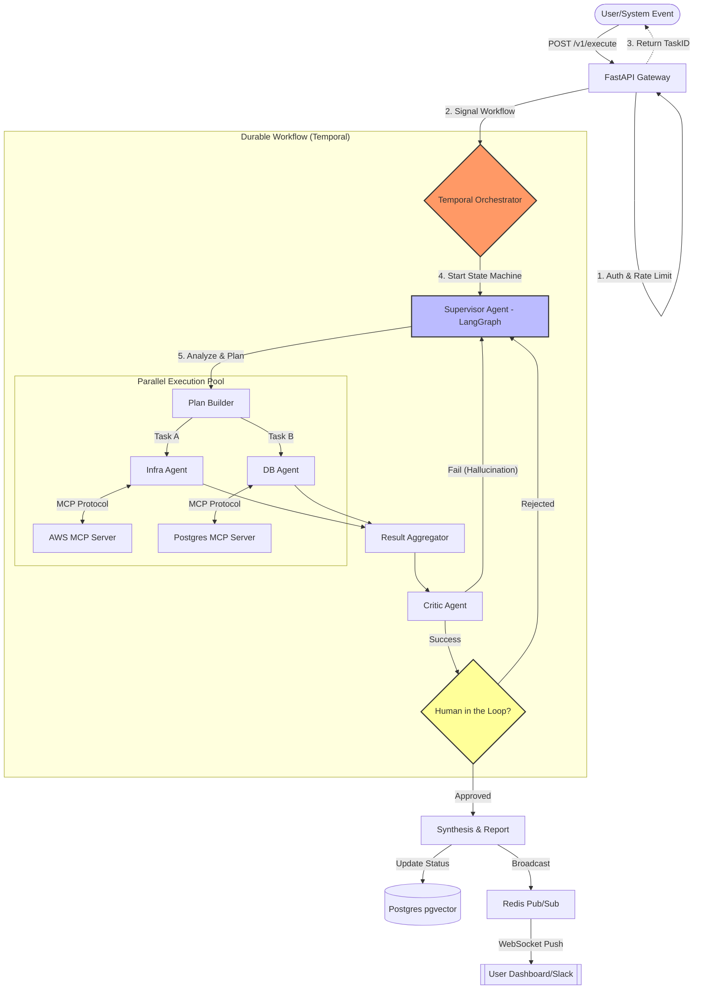

```mermaid
graph TD
    %% Entry Point
    User([User/System Event]) -->|POST /v1/execute| Gateway[FastAPI Gateway]
    Gateway -->|1. Auth & Rate Limit| Gateway
    Gateway -->|2. Signal Workflow| Temporal{Temporal Orchestrator}
    Gateway -.->|3. Return TaskID| User

    %% Orchestration Phase
    subgraph "Durable Workflow (Temporal)"
        Temporal -->|4. Start State Machine| Supervisor[Supervisor Agent - LangGraph]
        Supervisor -->|5. Analyze & Plan| Planner[Plan Builder]
        
        %% Parallel Execution
        subgraph "Parallel Execution Pool"
            Planner -->|Task A| AgentA[Infra Agent]
            Planner -->|Task B| AgentB[DB Agent]
            
            AgentA <-->|MCP Protocol| AWS[AWS MCP Server]
            AgentB <-->|MCP Protocol| PG[Postgres MCP Server]
        end

        %% Aggregation & Verification
        AgentA --> Aggregator[Result Aggregator]
        AgentB --> Aggregator
        Aggregator --> Critic[Critic Agent]
        
        %% Loops and Logic
        Critic -- "Fail (Hallucination)" --> Supervisor
        Critic -- "Success" --> HITL{Human in the Loop?}
    end

    %% Final Output
    HITL -- "Approved" --> Finalizer[Synthesis & Report]
    HITL -- "Rejected" --> Supervisor
    
    Finalizer -->|Update Status| DB[(Postgres pgvector)]
    Finalizer -->|Broadcast| Redis[Redis Pub/Sub]
    Redis -->|WebSocket Push| UI[[User Dashboard/Slack]]

    %% Styling
    style Temporal fill:#f96,stroke:#333,stroke-width:2px
    style Supervisor fill:#bbf,stroke:#333,stroke-width:2px
    style HITL fill:#ff9,stroke:#333,stroke-width:2px
```